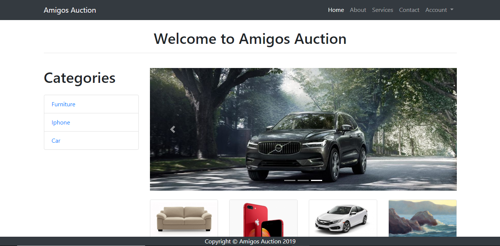
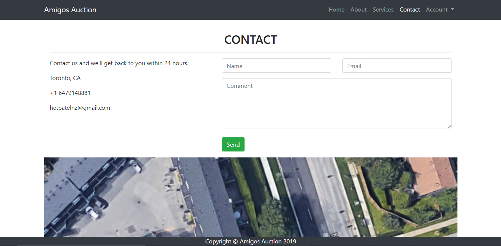
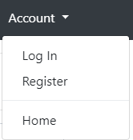
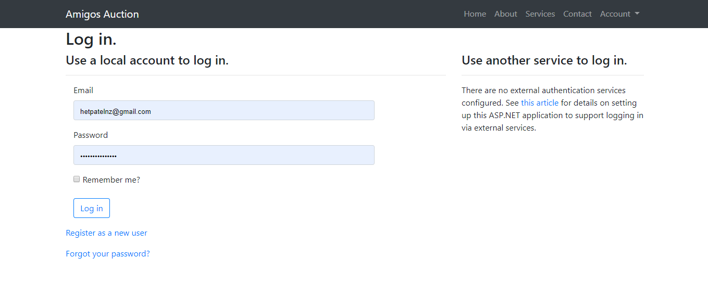
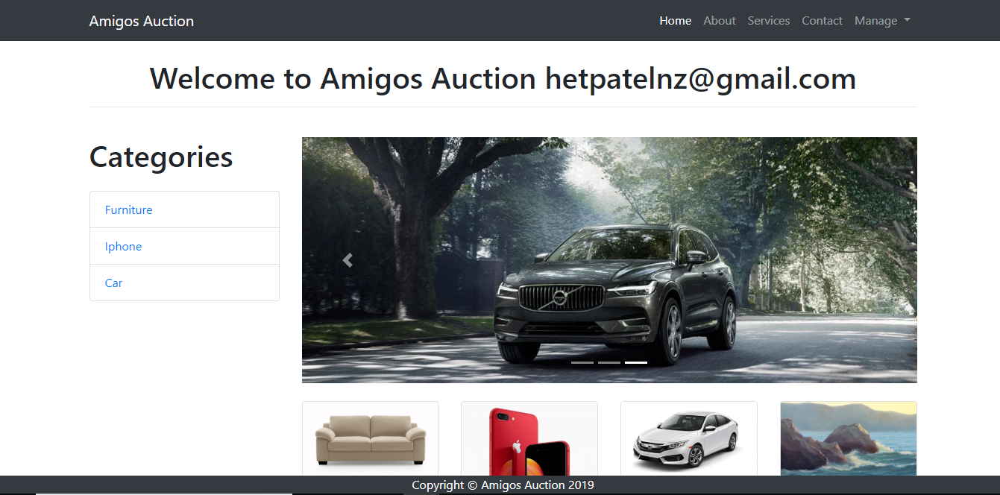
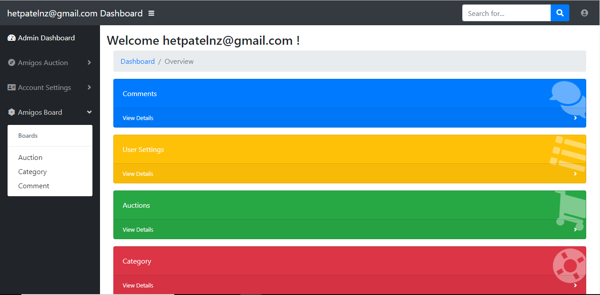
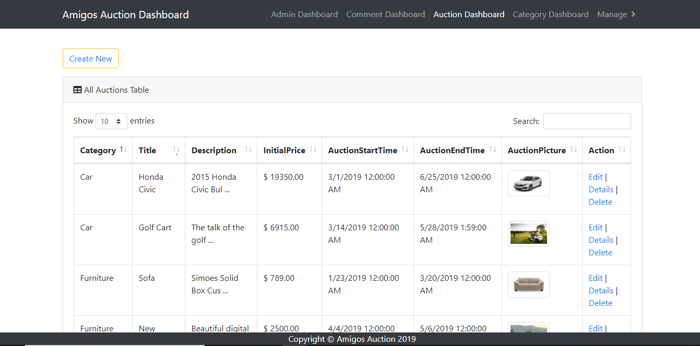
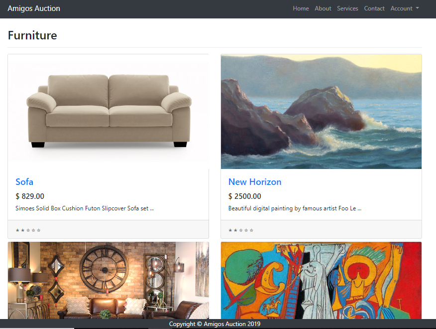
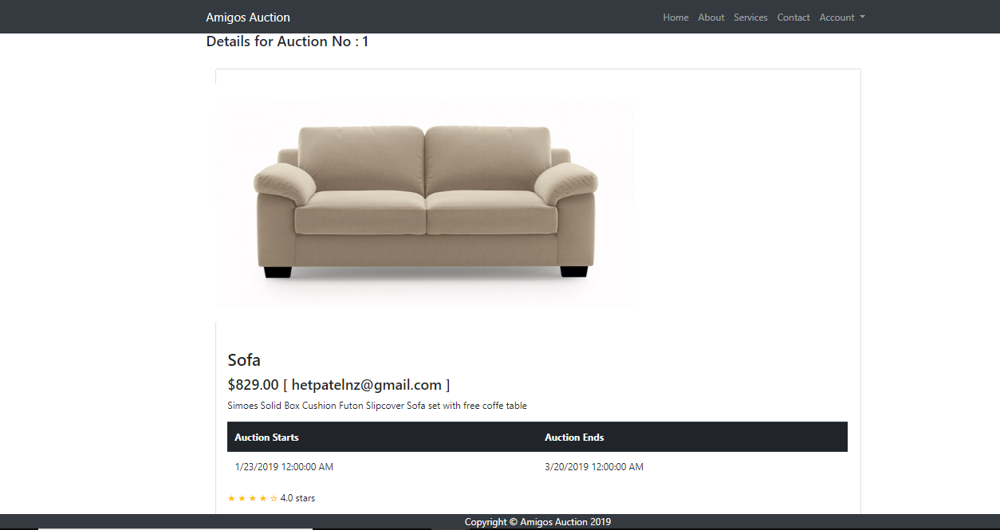
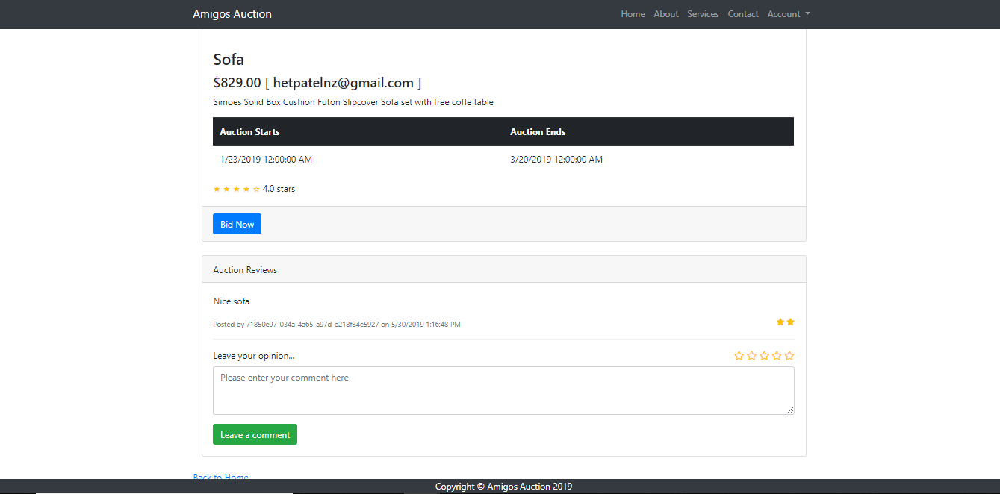

# Amigos Auciton Website

Amigos Auction is an ASP.net MVC based auction website where you see various ongoing auction based upon different categories. This project was developed from scratch with proper documentation for project proposal, User roles, user Stories, Iteration Plan, Release Plan, Project Maintenance, SQL Query and much more. A registered user can bid on any available auction. The website is fully dynamic meaning once you have bid on any given website the price would automatically be updated and the highest user list would get rearranged.

Here are few features listed for Amigos Auction:
1. User Authentication
2. Admin Dashboard - CRUD for Auction, Category, Comments and more...
3. Ability to rate and comment on any particular auction
4. Dummy Payment subsystem
5. Search auction, Sort them and to find auction based upon their description

ASP.net, Jquery, Javascript, Data-table, Node.js, Microsoft Owin Authentication is used for the purpose of this project.

## Home Page
 

## Contact Page
 

## Account
 

## Login/ Signup/ Forgot password
 

## Screen after login
 

## Admin Dashboard
 

## CRUD Auction Entity
 
Note: You can CRUD Auction, Category, Users and comments.

## Category wise results
 

## Auction details
 

## Auction details continued
 
